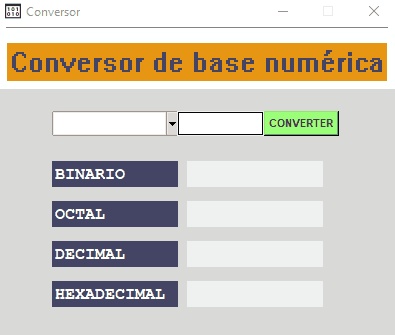

<!-- <h4 align="center"> 
---
	🚧  Projeto perfil do Github 🚀 Em construção...  🚧
</h4> 


<hr> -->


[](https://git.io/typing-svg)


- 👋 Hi, I’m Lucas Feliciano
- 👀 I’m interested in ...
- 🌱 I’m currently learning ...
- 💞️ I’m looking to collaborate on ...
- 📫 How to reach me ...

<!---
LucasFeliciano02/LucasFeliciano02 is a ✨ special ✨ repository because its `README.md` (this file) appears on your GitHub profile.
You can click the Preview link to take a look at your changes.
--->


<!-- Status -->

<!-- <h4 align="center"> 
---
	🚧  Projeto Conversor de bases numéricas 🚀 Em construção...  🚧
</h4> 

<hr> -->


<div align="center" id="top">
  
</h1>

 
  &#xa0;
 

 </div>
 
 
 <h1 align="center">Conversor de bases numéricas</h1>


<p align="center">
  <a href="#dart-sobre">Sobre</a> &#xa0; | &#xa0; 
  <a href="#sparkles-funcionalidades">Funcionalidades</a> &#xa0; | &#xa0; 
  <a href="#rocket-tecnologias">Tecnologias</a> &#xa0; | &#xa0; 
  <a href="#white_check_mark-pré-requisitos">Pré-requisitos</a> &#xa0; | &#xa0;
  <a href="#checkered_flag-começando">Começando</a> &#xa0; 
<!--  <a href="#autor">Autor</a> -->
</p>


<br>
				
	
## :dart: Sobre ##

```sh
• Conversor de bases numéricas muito útil para pesquisas rápidas, além do usuário poder usar em sua área de trabalho 
```

## :sparkles: Funcionalidades ##


:heavy_check_mark: Converter bases numéricas em outras bases numéricas;\
:heavy_check_mark: Usar para fazer trabalhos;\
:heavy_check_mark: Utilizar como aplicativo Executável em sua área de trabalho.

## :rocket: Tecnologias ##
 
 
As seguintes ferramentas 🛠 foram utilizadas na construção do projeto:


<table>
  <thead>
    <th>Back-end</th>
  </thead>
  <tbody>
    <tr>
      <td>Python</td>
    </tr>
    <tr>
      <td>Tkinter</td>
    </tr> 
	    
  </tbody>

</table>


## :white_check_mark: Pré-requisitos ##


Antes de começar 🏁, você vai precisar ter instalado em sua máquina as sequintes ferramentas:
[Git](https://git-scm.com/downloads) e [Python](https://www.python.org/downloads/).
Além disto é bom ter um editor para trabalhar com o código, tal como: [VS Code](https://code.visualstudio.com/download)


## :checkered_flag: Começando ##


```bash
# Clone este repositorio
 -> git bash here
  $ https://github.com/LucasFeliciano02/Calculadora_IMC-GUI.git

# Acesse a pasta do projeto que aparecerá em sua área de trabalho
 -> mouse esquerdo -> Abrir com Code

# Colocar os seguintes comandos no terminal para ativar o Interpretador do python a fim de rodar o arquivo
 1º  ->  py -m venv venv
 2º  ->  venv\Scripts\activate.ps1  
 3º  ->  .\venv\Scripts\activate.ps1  

# Baixar Run Code em extensões, tkinter no terminal e DESFRUTAR DO CÓDIGO
 -> terminal -> pip install tkinter

# Utilizando o executável:
 -> mouse esquerdo no arquivo.exe ->  Criar atalho  ->  Abrir o app na área de trabalho  &  Enjoy
```


---


<br>


<!---### Autor --->


Accomplished with :heart: by [LucasFeliciano02](https://github.com/LucasFeliciano02) 👋


[](https://www.linkedin.com/in/lucas-henrique-marques-feliciano-aa5aab222/) 


&#xa0;


<a href="#top">Voltar para o topo</a>

